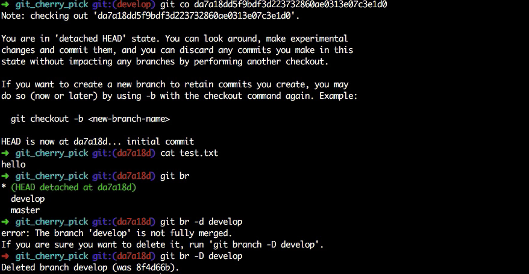

[toc]

### `user.name`和`user.eamil`配置位置

1. `/etc/gitconfig`：`git config --system`
2. `~/.gitconfig`：`git config --global`
3. 特定项目的`.git/config`文件中：`git config --local`

### 撤销
- `test.txt`已经被git管理，然后在工作空间对其做了修改
#### 工作空间修改，未add
  - 执行`git checkout -- test.txt`即可撤销,或者用`git checkout .`放弃所有修改
#### 工作空间修改，已add,未commit
  - `git reset HEAD test.txt`放弃指定文件的缓存，或者用`git reset HEAD .`放弃所有缓存，然后再执行**工作空间修改，未add**的命令进行回退
#### 工作空间修改，已commit
  - `git reset --hard HEAD^`来回退上一版本，或者`git reset --hard 【commit_id】`回退到具体某一版本。
### `git rm`、`rm`、`git mv`、`mv`

- `git rm`：比如有个`test.txt`文件已经`commit`到本地仓库，执行`git rm test.txt`表示：将其从工作空间删除，并将此操作提交到暂存区。 
- 如果想要将这个操作`commit`到本地仓库，只需要运行`git commit  -m "..."`即可。
- 如果想要回退删除操作，需要执行上述**工作空间修改，已add,未commit**操作：
    - 将暂存区回退到工作区：`git reset HEAD test.txt`
    - 将删除的这个动作丢弃：`git checkout -- test.txt`
- `git rm --cached test.txt`：将已经`commit`的`test.txt`删掉，这个删除的动作会添加到暂存区，`test.txt`文件本身已经从暂存区移除，变为未追踪的状态，但工作空间中还存在`test.txt`文件。
- 如果想要回退这个操作，只需执行`git reset HEAD test.txt`命令即可。
- `rm`：对于操作系统的`rm`命令，`rm test.txt`只是将这个文件删除，并未将操作添加到暂存区。
- `git mv`：比如一个`a.txt`文件已经`git commit -m "..."`提交到本地仓库，此时执行`git mv a.txt b.txt`表示将`a.txt`重命名为`b.txt`并将操作添加到暂存区。
- 如果想要回退,需要执行上述**工作空间修改，已add,未commit**操作
    - 将暂存区退回到工作区，把暂存区的修改撤销掉：` git reset HEAD a.txt`，
    - 将重命名这个动作丢弃：`git checkout -- a.txt`，
    - 将暂存区退回到工作区：` git reset HEAD b.txt`，
    - 删除`b.txt`文件：`rm b.txt`即可
- `git checkout -- <file>`：
     	1. `file`修改后暂未`add`：撤销修改回到和版本库一模一样的状态(回到最近一次`commit`状态)
     	2. `file`已`add`，然后被修改：撤销修改回到添加到暂存区后的状态。(回到最近一次`add`状态)
- `mv`：操作系统的`mv`命令，只是移动文件，并不会添加到暂存区
- 帮助

  - `git help config`
  - `git config --help`
  - `man git-config`

### 日志

- 日志

  - `git log -3`：查看最近三条日志
  - `git log --pretty=oneline`：一行展示
  - `git log --pretty=format:"%h - %an,%ar : %s"`：格式：`id - username,time : message`
- 终端：

  - `control + a`/`ctrl + a`：光标跳到命令开头

  - `contorl + e`/`ctrl + e`：光标跳到命令末尾
- `mkdir mydir &&  cd mydir`：创建`mydir`这个目录并进入
- `cd -`：回到上一次的目录
- `!!`：显示并执行上一条命令

### 分支

- 分支可用来隐藏文件哦~~
- 分支

  - `git branch`：查看当前分支
  - `git branch test`：创建一个新分支`test`
  - `git checkout test`：切换到`test`分支
  - `git branch -d test`：删除`test`分支(前提是该分支已经`merge`并且该分支不是当前所处分支)
  - `git branch -D test`：删除`test`分支(无论该分支是否已经`merge`)
  - `git checkout -b test`：创建`test`分支并切换到`test`分支
  - `git merge test`：假设当前处于`master`分支，执行这个命令即将`test`分支`merge`到`master`上，但不会产生新的`commit`，会把靠后的那个分支指向最新的一个`commit` 上面
  - `git merge --no-ff test`：(`ff`：`fast forward`)假设当前处于`master`分支，执行这个命令即将`test`分支`merge`到`master`上，这个`merge`操作会生成一个新的`commit``
  - `git branch -v`：显示当前分支最新的一条提交信息
  - `HEAD`：永远指向当前分支（`.git`目录下的一个文件）
  - `git log --graph`：图形化方式显示日志
  - `git commit -am "message"`：添加当前目录的所有文件并提交（该文件必须已经被`git`管理，即已经被`git add`的文件，在`commit`后，如果被修改，`git commit -am`相当于`add`再`commit`，但如果是新建的文件，必须先`git add`）

### 版本回退

- `git reset --hard HEAD^`：回退上一个版本
- `git reset --hard HEAD~n`：回退到前面第`n`个版本
- `git reset --hard xxx`：回退到`commit` `id`为`xxx`的版本
- `git reflog`：操作日志，不同于`git log`提交日志，任何修改了`HEAD`的操作都会被记录下来。比如总共4个`commit`，`git log`显示4个，回退两个版本后，`git log`只显示前面两个`commit` `log`了，此时就无法再回到最新的`commit`，因为`git log`不会显示它的`commit` `log`，就无法知道它的`commit` `id`，此时就可以用`git reflog`，现实所有的操作日志
- `git checkout -- test.txt`：丢弃掉相对于暂存区中最后一次添加的文件内容所做的变更。比如在工作空间中修改`test.txt`但未添加到暂存区中，运行这个命令就会丢弃这些更改，但对于已添加到暂存区的修改不受影响。如果想要撤销添加到暂存区的操作，可以运行`git reset HEAD test.txt`命令。
- `git branch -m test1 test2`：将`test1`分支重命名为`test2`分支
- 在`master`分支上创建`test`分支，然后在`master`上执行一个`commit`，再切换到`test`分支，在`test`分支的工作空间修改文件以实现功能，可能这个修改所实现的功能还没有开发完，所以此时这个修改是不能`commit`的，在这个修改`commit`之前，是不能切换到`master`上的，因为一旦切换，这个修改就会丢失。但此时又需要切换到`master`分支开发别的功能。
  - 此时就应该用`git stash`命令将工作保存起来。保存后，正常切换到`master`分支，别的功能开发完后，再切到`test`分支，`git stash list`可以显示保存的列表。可通过`git stash save "xxx"`添加新的`stash`，`xxx`为`message`。
    - 取出这个`stash`可执行`git stash pop`命令，它会将之前的`stash`恢复过来，并删除这个`stash`，再执行`git stash list`就会少一个`stash`。
    - 取出这个`stash`也可执行`git stash apply`命令，它会将之前的`stash`恢复过来，但不删除这个`stash`，再执行`git stash list`结果与执行`git stash apply`命令之前一样。如果想要删除这个`drop`，需要手动执行`git stash drop stash{n}`(`n`为`0,1,2...`，即已存在的`stash`编号)。

### 标签

- `git tag v1.0`：创建`v1.0`这个标签，仅仅是指向当前`commid_id`的一个指针，属于轻量级标签
- `git tag -a v2.0 -m "2.0 released"`：创建`v2.0`这个标签并添加注释`2.0 released`，属于重量级标签，它包含标签对象本身的`id`值以及标签对象所指向的`commit_id`值。
- `git tag` ：查看标签列表
- `git tag -l 'v*'`：搜索以`v`开头的所有`tag`
- `git tag -d v1.0`：删除`v1.0`这个本地的`tag`
- `git show v1.0`：显示`v1.0`的信息
- `git push origin v1.0 v2.0`：将`v1.0`、`v2.0`这个两个标签推送到远程，比如将`v1.0`这个`tag`推送到远程，完整的写法是`git push origin refs/tags/v1.0:refs/tags/v1.0`
- `git push origin --tags`：将本地未推送到远程的所有标签都推送到远程，另外的用户通过`git pull`命令就可以把这些`tag`拉取下来，也可以用`git fetch origin tag v7.0`把`v7.0`这个`tag`拉去下来。
- `git push origin  :refs/tags/v6.0`：删除远程的`v6.0`这个分支，`:`这种写法类似于`git push`的完整写法。执行这个命令时，远程`v6.0`这个`tag`会被删掉，但本地的`v6.0`这个`tag`还在
- `git push origin --delete tag v5.0`：删除远程的`v5.0`这个分支，同样本地的`v5.0`这个`tag`还在
- `tag`不是依赖于分支的

- `git blame test.txt`：谁在哪个时间修改了`test.txt`文件
- `diff`
  - 工作区与暂存区
    - `git diff`：比较工作区与暂存区的差别
  - 工作区与本地仓库
    - `git diff HEAD`：比较工作区与最近`commit`的差别
    - `git diff commit_id`：比较工作区与指定`commit_id`的这个`commit`之间的区别
  - 暂存区与本地仓库
    - `git diff --cached`：暂存区与最近的`commit`的区别
    - `git diff --cached commit_id`：暂存区指定`commit_id`的这个`commit`之间的区别
- 远程
  - `git remote show`：列出与当前仓库关联的所有远程仓库
  - `git remote show origin`：列出远程`origin`这个仓库的详细信息
- `ohmyzsh`中输入`l`或者`ll`，如果存在`xxx -> yyy`，即表示软链接，类似于`windows`的快捷方式
- `git branch -a`：列出所有分支，包括远程分支
- `git branch -av`：列出所有分支，包括远程分支，以及分支的`commit`等信息
- `git clone xxx yyy`：将`xxx`项目克隆到`yyy`目录中(如果不指定`yyy`，那么这个克隆的项目所在的目录名称就和项目名称相关，指定之后，就以 `yyy`为目录名称)
- 别名

  - `git config --global alias.br branch`：将`branch`设置别名为`br`，之前的`git branch -a`命令可以用`git br -a`替代了，对应的配置文件位于`~/.gitconfig`
- `refpsec`：本地分支与远程分支的对应关系，默认情况下，`refspec`会被`git remote add`命令所自动生成，`git`会获取远端上`refs/heads`下的所有引用，并将它们写到本地的`refs/remotes/origin`目录下。所以，如果远端上有一个`master`分支，你在本地就可以通过下面几种方式来访问它们的历史记录：`git log origin/master`、`git log remotes/origin/master`、`git log refs/remotes/origin/master`
  - 如果想将本地`develop`分支`push`到远程，但远程没有分支与之对应，会报错，需要用`git push --set-upstream origin develop`命令或者`git push -u origin develop`命令，让远程的`develop`分支与本地分支对应，但如果执行这条命令时，远程没有`develop`分支就会报错，此时需要先执行`git push origin src:develop`创建`develop`分支并推送。
  - 远程创建新的`develop`分之后，假设另外一个人执行`git pull`，那么另外一个人会看到`origin/develop`这个新建的远程分支，但他本地的分支不会变（即他本地是没有`develop`这个分之的），如果他想接着远程那个分支开发，需要执行`git checkout -b develop origin/develop`或者`git checkout --track origin/develop`命令（这两个命令的区别就是第一个可以指定本地分支的名字，第二个命令不指定名字，默认名字与远程一致），在本地新建一个分支与远程的`develop`分支一致，而不是执行 `git checkout -b develop`，因为他需要和远程的`develop`保持一致，而不是与本地的`master`分支一致
- 删除远程分支
  - `git push`完整写法：`git push origin src:dest`，`src`：本地分支，`dest`：远程分支，将`src`这个本地分之推送到远程的`desc`这个分之，所以删除远程分支可以是`git push origin  :develop`：即把空格作为`src`，即可删除远程的`develop`分支
  - `git push origin --delete develop`：删除远程`develop`分支
  - 如果`user1`执行`git push origin --delete develop`把远程分支`develop`删掉，此时`user2`是不知道的，`user2`执行`git remote show origin`会发现远程的`develop`分支状态是`stale`，因为没有分支与它对应(其他的远程分支，本地有分支与它对应，状态是`tracked`)，`user2`也是不能执行`git pull origin develop:develop`的，因为远程`develop`分支已被删除。`user2`此时可以执行`git remote prune origin`将这个`stale`状态的远程`develop`分支删除。再次执行`git remote show origin`就一切正常了
- 重命名远程分支
  - 删除远程`develop`分之：`git push origin --delete develop`
  - 重新建立关联：`git push --set-upstream origin develop2`
- `git pull`完整写法：`git pull origin src:dest`，与`git push`完整写法同理
- `HEAD`标记：
  - 是一个指向你当前所在分支的引用标识符，该文件内部并不包含`SHA-1`值(即`commit_id`)，而是指向另外一个引用的指针
  - 当执行`git commit`命令时，`git`会创建一个`commit`对象，并且将这个`commit` 对象的`parent`指针设置为`HEAD`所指向的引用的`SHA-1`值
  - 我们对于`HEAD`修改的任何操作，都会被`git reflog`记录下来
  - 实际上，我们可以通过`git symbolic-ref HEAD`来实现对`HEAD`文件内容的修改
- `ORI_HEAD`标记：远程`HEAD`所处的`commit_id`
- 删除远程仓库：`git remote rm origin`
- 添加远程仓库：`git remote add origin xxx`
- `git gc`：`GC`
- `git`裸库：没有工作区的`git`仓库，仅仅用来存放开发者提交代码的区域，创建：`git init --bare`

### `submodule`

- `submodule`：解决项目之间的依赖。如果用引入`jar`包的方式，`jar`一旦需要频繁更改就不方便，而且`submodule`还支持不同语言的项目之间的依赖。
    - 比如项目`child`依赖于`parent`，这两个项目分别都是独立的由`git`管理的项目
    - 可在`child`中运行`git submodule add  git@github.comxxx.git  mymodule`命令，会将`parent`项目拉取到`child`项目的`mymodule`文件夹中，`git@github.comxxx.git`是`parent`项目的地址，`mymodule`必须是一个不存在的文件夹，执行命令后`git`会自动生成这个文件夹
    - 执行该命令后，会生成一个`.gitmodules`文件和一个`mymodule`目录，该目录中就是`parent`项目的文件。
    - 在`child`项目中进行`add`、`commit`、`push`即可把`parent`作为本项目的一部分推送到远程
    - 如果`parent`项目有更新，更新完后推送到远程，在`child`项目中，进入到`mymodule`目录中，`git pull`即可拉取`parent`的更新。
    - 如果`child`项目依赖于多个`parent`项目，这些`parent`项目更新后，一个个拉取很麻烦，可以在`child`的`.gitmodules`文件所在目录执行`git submodule foreach git pull`即可一次性拉取。
    - 如果此时有其他人克隆这个项目：`git clone git@github.comxxx.git  myPro`，即将`child`这个项目克隆到`myPro`目录中，但直接这样，`parent`项目中的文件无法克隆下来，即`mymodule`目录中没有文件，此时可以在`myPro`中执行`git submodule init`命令，初始化`submodule`，再执行`git submodule update --recursive`命令，即可将`parent`项目文件克隆下来。
    - 其他人克隆项目时，也可以直接执行`git clone git@github.comxxx.git myPro --recursive`命令，将`child`项目及其子模块一起克隆到`myPro`目录中。
    - 如果要在`child`项目中删除依赖的`parent`项目模块，可以执行`git rm --cached mymodule`将其从暂存区删除，然后`rm -rf mymodule`，将该目录删掉，再`add`、`commit`、`push`推送到远程，删除完`mymodule`后，`rm  .gitmodules`文件，`add`、`commit`、`push`三连，即可完全删除`parent`模块
    - `git submodule`存在的问题：如果被依赖项目（比如`parent`项目）只是单向修改（在`parent`项目本身中修改，`child`中拉取）没什么问题，如果被依赖项目双向修改（`child`项目中直接修改`parent`项目文件）就会出现问题；而且`git`本身并没有提供很好的删除`submodule`的命令

### `subtree`

- `subtree`解决的问题和`submodule`一样
    - 比如项目`child`依赖于`parent`，这两个项目分别都是独立的由`git`管理的项目
    - 可以在`child`中执行`git remote add subtree-origin git@github.comxxx`命令，将`parent`项目作为`child`的一个远程仓库，名为`subtree-origin`，注意`child`本身已经有一个名为`origin`的远程仓库。`git@github.comxxx`为`parent`项目的仓库地址
    - 第二步，添加`subtree-origin`这个远程依赖库：`git subtree add --prefix=mysubtree subtree-origin master --squash`或者``git subtree add -P mysubtree subtree-origin master --squash``或者`git subtree add --prefix mysubtree subtree-origin master --squash`，将`subtree-origin`这个远程库的`master`分支拉取到`mysubtree`目录中，`--squash`是一个可选参数，如果加上，`subtree-origin`库本身的多次提交（如果有）就会合并为一次提交，比如`subtree-origin`库原来有`3`个提交，有`3`个`commit message`，那么合并的提交就是第`4`个提交，`commit message`会显示原来的`3`个`commit`的`commit message`，然后拉取到`mysubtree`中，与`child`项目做一个合并，产生第`5`个提交。参数作用：防止`parent`仓库的提交历史污染了`child`的提交历史。如果不加，会把`subtree-origin`的提交一个一个的拉取到本地，比如`subtree-origin`库原来有`3`个提交，有`3`个`commit message`，拉取到本地后再与`child`项目合并，创建一个新的`commit`，即第`4`个`commit`。即`parent`的提交历史就会污染`child`。**如果一开始的命令没有使用`--squash`，后续所有的`subtree`操作都不能使用`--squash`参数，如果一开始使用了`--squash`参数，后续的命令也要加上`--squash`**
    - 执行后，`child`项目中就会新增一个`mysubtree`目录，里面就是`parent`项目的文件。`child`执行一个`push`即可和它本身的`origin`保持一致
    - 建立关系后，如果`parent`项目有更新（在它本身的目录中更新），直接更新即可，`add`、`commit`、`push`到远程，再在`child`项目中进行拉取：`git subtree pull --prefix=mysubtree subtree-origin master --squash`即可（这里加了`--squash`参数，所以拉取后，在`child`中执行`git log`，可以发现没有`parent`项目本身的`log`，即只显示`child`原来项目的`log`、`parent`项目所有的`commit`合并的一个新的`commit`，以及`parent`项目之前所有`commit`合并后再与`child`项目合并的又一个新的`commmit`。如果不加这个参数，`child`中`git log`命令就可以看到`child`项目的所有`commit`、`parent`项目的`commit`信息，以及它们合并的新的`commit`），`child`项目中的`git log subtree-origin/master`命令可以看到`parent`项目的`log`
    - 建立关系后，如果`parent`项目有更新（在`child`项目的`mysubtree`目录中更新），直接更新即可，`add`、`commit`、`push`到远程，`push`后，`child`项目的远程仓库中已经有了`parent`的最新更改，但`parent`项目本身的目录中并没有这个更改，此时可以在`child`中执行`git subtree push --prefix=mysubtree subtree-origin master`，即将`mysubtree`中对`subtree`的更改推到`subtree-origin`这个远程仓库的`master`分支，然后在`parent`项目中执行`git pull`命令即可将最新修改拉取到本地。

### `cherry-pick`

- `git cherry-pick`：将一个分支上的`commit`移到另一个分支上去

  - 有一个`master`分支，它上面有一个初始`commit`

    

  - 在`master`分之上创建一个`develop` 分之，`develop`分支上进行两次`commit`

    

  - 此时`develop`分支上就有三个`commit`信息了：

    

  - 如果此时发现改错分支了（即上面`develop`分支的两次`commit`应该在`master`分支上进行，但却在`develop`分支上做了修改），如果不用`cherry pick`，只能将`develop`的修改撤销，重新在`master`分支上修改。用`cherry pick`的做法：

  - 此时`master`分支只有一个`commit`

    

  - 在`master`分支上执行`cherry-pick`命令，`cherry-pick`后面的`commit id`就是`develop`分支两次`commit`中第一次的`commit id`。

    

  - 执行之后，`master`分之多一个`commit`，这个`commit`的`commit message`就是`develop`分之的那个 `commit message`

    

  - 再次查看`master`分之的内容，可以发现`develop`分之新增的两次`commit`中的第一次的`commit`已经应用到`master`分之上

    

  - 同样的方式，将`develop`分支新增的第二次`commit`应用到`master`分之上

    

  - 结果预期一致

    

  - 如果先将`develop`分之新增的第二个`commit`应用到`master`分之上（即上图中先执行`git cherry-pick 933ea5`，再执行`git cherry-pick 5a0d3d`），就会出现冲突，必须依次执行。

  - 如果此时想将`develop`分之上的修改删掉（即本来就应该在`master`分之上进行修改，上述`cherry-pick`操作已经将`commit`应用到`master`分之上，那么`develop`分之上的`commit`就应该删掉，`develop`应该回到初始的`commid id`为`da7a18dd`那次`commit`上），可以使用`reset`，也可以使用`checkout`（这里的`co`是配置了`alias`）

    

  - 执行结果（`br`是配置了 `alias`）

    

  - 直接将`develop`分之删掉

    

  - 删掉后再创建一个`develop`分之（`st`是配置了`alias`）

    

  - `develop`就恢复到了初始状态

### `merge`、`rebase`
- `git rebase -i HEAD~3`：合并3个`commit`

- `git rebase`   `git merge`

  - 比如在`c2`这个`commit`地方有两个分支`origin`、`mywork`（这里的`origin`是普通分支，不是远程分支）

    

  - 每个分支上都进行了不同的提交

    

  - 如果使用`merge`操作（将`origin`分支`merge`到`mywork`上面），结果：

    

  - `merge`操作会产生一个新的`commit`，这个`commit`有两个`parent`。

  - 如果使用`rebase`操作（`git checkout mywork`、`git rebase origin`），结果：

    

  - 原来的`c5`、`c6`就没用了

    

  - 整个提交历史变成了这个样子

    

  - `rebase`注意事项

    - 执行`rebase`也会出现冲突，解决冲突后，使用`git add`添加，然后执行`git rebase --**** continue`，接下来`git`会继续应用余下的补丁
    - 任何时候都可以通过`git rebase --abort`命令终止`rebase`，如果执行，那么进行`rebase`的两个分支会恢复到`rebase`开始前的状态

  - `git rebase`最佳实践

    - 不能在于其他人共享的分支上进行`rebase`，只能在不与其他人共享的本地分支上进行
    - 不要对`master`分支执行`rebase`，否则会引起很多问题
    - 一般来说，执行`rebase`的分支都是自己的本地分支，没有推送到远程版本库

  - 仓库初始化

    

    

  - `develop`新增两个`commit`

    

    

  - `test`分支新增两个`commit`

    

    

  - 此时`develop`分支和`test`分支在从`master`分支上创建出来后，分别有两个`commit`。在`test`分支上进行`rebase`：`git rebase develop`

    

    自动合并`test.txt`发生了冲突，

  - 提示当前在`b466`这个`commit`上进行`rebase`（`b466`这个`commit`就是`develop`分支的最后一个`commit`），可以使用`git rebase --abort`检出原始分支（如下图，执行这个命令后初始状态）；可以使用`git rebase --skip`忽略当前这个补丁（即丢弃`test`分支上的修改，以`develop`分支上的修改为准）

    

  - 这里执行`git rebase --abort`回到初始状态后，再次执行`git rebase develop`进行变基

    

  - 在`test.txt`中有如下冲突（即以`develop`分支为基础，将`test`分支为补丁应用到其上）

    

  - 如果只想保留`develop`分支对`test.txt`的修改，可以执行`git rebase --skip`丢弃当前补丁（丢弃`test`分支对`test.txt`的修改），执行之后，开始应用`test2`这个补丁（因为`test`分支有两个提交`test1`、`test2`，`test1`被丢弃后，就轮到`test2`了，此时冲突内容就是`test2`与`develop`的最后一次`commit`之间的冲突）

    

  - 如果再次`git rebase --skip`，就将`test2`这个补丁也丢弃掉了，变基结束，因为`test1`、`test2`都丢弃掉了，所以最终文件内容就是`develop`分支的文件内容

    

  - 在`test`分支上查看`log`，发现其`log`就是`develop`分支的`log`

    

  - 在`develop`上又创建两个`commit`，`git log`如下

    
    

  - 在`test`分支上创建两个`commit`，`git log`如下

    

    

  - 在`test`分支上执行`git rebase develop`，产生冲突，解决冲突

    

    

    

  - 解决冲突后，变基完成

    

  - `test`分支的`git log`

    

  - 此时切换到`develop`分支，与`test`分支一`merge`，就会发生`Fast forward`

    

- `test`分支上执行`git merge develop`：将`develop`分支的所有修改应用到`test`分支上

- `test`分支上执行`git rebase develop`：以`develop`分支为基，将`test`上的提交以补丁的方式保存起来，再将补丁以回放的方式在`develop`分支上进行一个个的应用，应用之后，`test`上的提交就没用了。
- 比如，原来的分支情况
    
- 在`master`上执行`git rebase test`后，`master`上的`commit`会以补丁的形式一个个应用到`test`上，所以`master`的`commit`情况变为
    
  

- [rebase后push的问题](https://www.cnblogs.com/xinmengwuheng/p/11301657.html)

